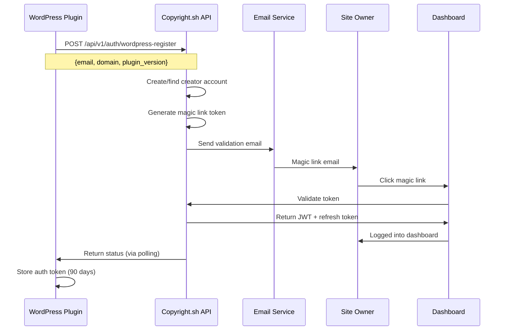

# WordPress Plugin Account Creation Feature Specification

## Overview
Add seamless one-click account creation to the Copyright.sh AI License WordPress plugin, enabling site owners to register with the Copyright.sh dashboard without leaving WordPress admin.

## Business Requirements

### User Stories
1. **As a WordPress site owner**, I want to create a Copyright.sh account directly from my WordPress admin, so I can start tracking AI usage and collecting payments without manual registration.

2. **As a WordPress site owner**, I want my domain automatically linked to my account, so I don't have to manually add it in the dashboard.

3. **As a WordPress site owner**, I want to authenticate securely without passwords, so I can access my dashboard easily and safely.

## Technical Architecture

### Authentication Flow (OAuth-like with Magic Links)



### Implementation Phases

#### Phase 1: Basic Registration (MVP)
- Add "Copyright.sh Account" section to plugin settings
- Email field with "Create Account" button
- Show registration status
- Store basic connection state

#### Phase 2: Full Integration (Post-MVP)
- Auto-populate dashboard data from WordPress
- Two-way sync of settings
- Usage statistics display in WordPress
- Payment setup prompts

## Plugin UI Changes

### New Settings Section
```php
// Add after existing settings fields
add_settings_section(
    'csh_ai_license_account',
    'Copyright.sh Account',
    [$this, 'render_account_section'],
    'csh-ai-license'
);
```

### Account Section UI States

#### 1. Not Connected
```html
<h3>Copyright.sh Account</h3>
<p>Connect to the Copyright.sh dashboard to:</p>
<ul>
  <li>Track AI usage of your content</li>
  <li>View earnings and analytics</li>
  <li>Configure payment methods</li>
</ul>
<input type="email" placeholder="your@email.com" />
<button>Create Account & Connect</button>
```

#### 2. Email Sent
```html
<h3>Copyright.sh Account</h3>
<div class="notice notice-info">
  <p>✉️ Check your email! We've sent a magic link to verify your account.</p>
  <p>Once verified, your dashboard access will be activated.</p>
</div>
<button>Resend Email</button>
```

#### 3. Connected
```html
<h3>Copyright.sh Account</h3>
<div class="notice notice-success">
  <p>✅ Connected to Copyright.sh</p>
  <p>Account: user@example.com</p>
  <p>Domain: example.com (verified)</p>
</div>
<a href="https://dashboard.copyright.sh" class="button">Open Dashboard</a>
<button class="button-secondary">Disconnect</button>
```

## API Endpoints Required

### 1. WordPress Registration
```http
POST /api/v1/auth/wordpress-register
Content-Type: application/json

{
  "email": "user@example.com",
  "domain": "example.com",
  "plugin_version": "1.2.1",
  "wordpress_version": "6.5",
  "php_version": "8.0"
}

Response:
{
  "status": "email_sent",
  "message": "Verification email sent",
  "creator_id": "uuid-here"
}
```

### 2. Check Registration Status
```http
GET /api/v1/auth/wordpress-status?email=user@example.com&domain=example.com
Authorization: Basic {plugin_token}

Response:
{
  "registered": true,
  "verified": true,
  "token": "jwt-token-here",
  "expires_in": 7776000  // 90 days
}
```

### 3. Refresh Token
```http
POST /api/v1/auth/refresh
Authorization: Bearer {expired_token}

Response:
{
  "token": "new-jwt-token",
  "expires_in": 7776000
}
```

## WordPress Database Storage

### Options Table
```php
// Store in wp_options
'csh_account_status' => [
    'connected' => true,
    'email' => 'user@example.com',
    'token' => 'jwt-token-here',
    'token_expires' => 1234567890,
    'creator_id' => 'uuid-here',
    'last_sync' => 1234567890
]
```

## Security Considerations

### Token Management
- Store JWT securely in wp_options (not exposed to frontend)
- Auto-refresh tokens before expiry (< 7 days remaining)
- Clear tokens on plugin deactivation
- Validate token on each admin page load

### Data Protection
- Email validation required before account activation
- Domain ownership verified via payto matching
- HTTPS required for all API communications
- No passwords stored anywhere

### Rate Limiting
- Max 3 registration attempts per domain per hour
- Max 5 email resends per day
- Exponential backoff on API failures

## Implementation Tasks

### Backend (API) Requirements
1. ✅ Magic link authentication already exists
2. ⚠️ Need WordPress-specific registration endpoint
3. ⚠️ Need status checking endpoint with Basic auth
4. ⚠️ Need domain auto-verification on registration

### Plugin Development Tasks
1. Add account section to settings page
2. Implement AJAX registration flow
3. Add email validation UI
4. Store and manage JWT tokens
5. Add "Open Dashboard" link when connected
6. Implement token refresh mechanism
7. Add disconnect functionality

### Dashboard Updates
1. Auto-add domain on WordPress registration
2. Show "WordPress Connected" badge
3. Skip domain verification for WordPress domains
4. Track plugin version for support

## Success Metrics

### Technical
- Registration completion rate > 80%
- Email delivery success > 95%
- Token refresh success > 99%
- API response time < 2s

### Business
- WordPress users creating accounts > 50%
- Connected users viewing dashboard > 70%
- Connected users adding payment method > 40%
- 90-day retention > 60%

## Error Handling

### Common Scenarios
1. **Email already registered**: Show login link
2. **Domain already claimed**: Show verification required
3. **API timeout**: Retry with exponential backoff
4. **Invalid email**: Client-side validation
5. **Token expired**: Auto-refresh or re-authenticate

### User Messaging
- Clear error messages with actionable steps
- Support email link in error states
- Retry options for transient failures
- Success confirmations at each step

## Testing Requirements

### Unit Tests
- Token storage and retrieval
- Email validation
- API response handling
- Error state management

### Integration Tests
- Full registration flow
- Token refresh cycle
- Domain verification
- Dashboard redirect

### Manual Testing
- Various email formats
- Subdomain handling
- Network failure recovery
- Multiple WordPress instances

## Timeline

### Week 1
- API endpoint development
- Basic plugin UI implementation
- Token storage mechanism

### Week 2
- Email validation flow
- Dashboard integration
- Error handling

### Week 3
- Testing and refinement
- Documentation
- Deployment

## Future Enhancements

### Phase 2 Features
- Usage statistics in WordPress admin
- Earnings display widget
- One-click payment setup
- Bulk domain management
- Team account support
- White-label options

### Phase 3 Integration
- WooCommerce integration for e-commerce
- Membership plugin compatibility  
- Multisite network support
- REST API for headless WordPress
- Gutenberg block for per-page licensing

## Conclusion

This feature transforms the WordPress plugin from a simple meta tag injector to a full platform integration, dramatically reducing friction for creators to start earning from AI usage of their content.

The OAuth-like flow with magic links provides security without password complexity, while the 90-day token renewal balances convenience with safety.

By enabling one-click registration directly from WordPress, we remove the biggest barrier to adoption and can capture the massive WordPress market (43% of all websites) for Copyright.sh.