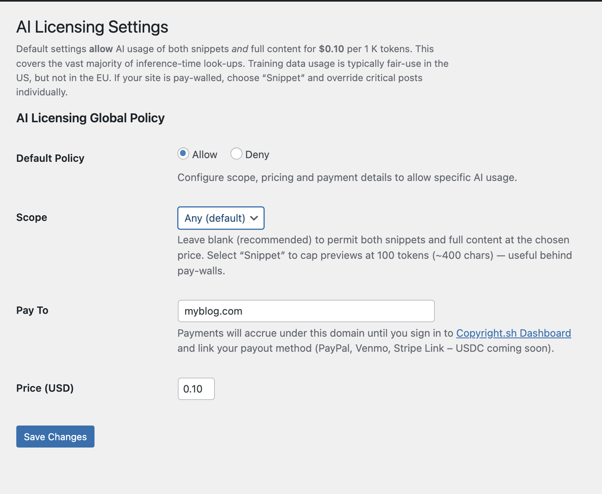
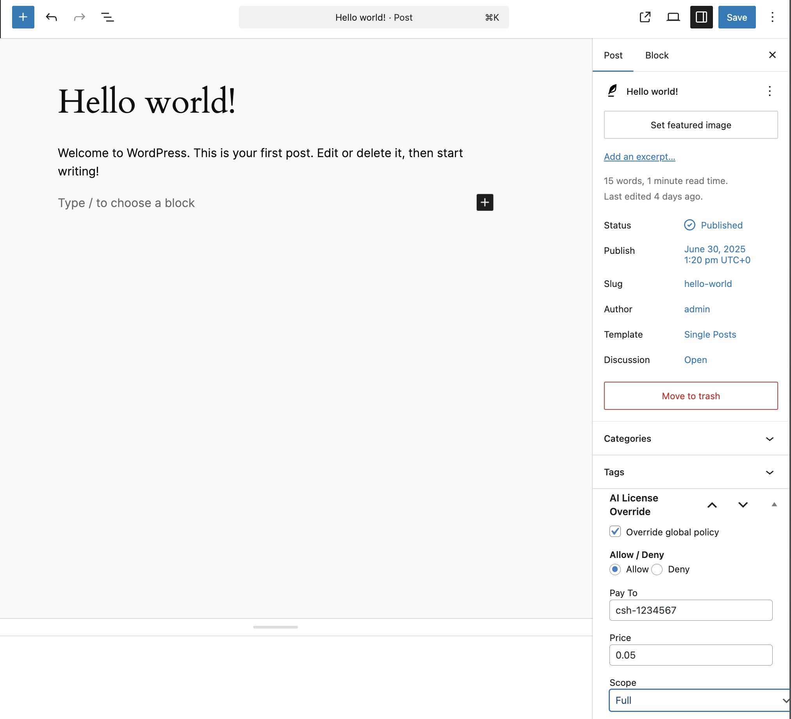

# Copyright.sh — AI Licensing for WordPress

**Version&nbsp;0.1.1** • GPL-3.0-or-later  
<https://copyright.sh>

Easily declare, customise and serve a *machine-readable* AI-usage licence for your WordPress site.

The plugin adds:

* A global **Settings → AI License** screen to configure your preferred policy (`allow` or `deny`) together with optional *payto*, *price* and *scope* parameters.
* A **per-post meta-box** to override the global policy when needed.
* Automatic output of the `<meta name="ai-license">` tag on the front-end.
* A dynamic `/ai-license.txt` endpoint that mirrors the same policy for crawler consumption.

---

## Table of Contents

1. [Installation](#installation)
2. [Usage](#usage)
3. [Screenshots](#screenshots)
4. [Filters & Actions](#filters--actions)
5. [Contributing](#contributing)
6. [Changelog](#changelog)

---

## Installation

1. Download the latest release ZIP from GitHub.
2. Inside your WordPress admin go to **Plugins → Add New → Upload Plugin** and upload the ZIP.
3. Click **Activate**.

Alternatively with Composer:

```bash
composer require copyrightsh/ai-licensing-wp
```

---

## Usage

1. Navigate to **Settings → AI License**.
2. Choose whether to *Allow* or *Deny* AI usage.
3. Optionally set:
   * **Price** – suggested price in USD (default **0.10** per 1 K tokens).
   * **Scope** – leave blank (default) to allow both snippets and full content. Choose `snippet` (≤100 tokens ≈ 400 chars) to restrict previews, useful behind paywalls.
   * **Pay To** – defaults to your domain (e.g. `example.com`). Payments accrue under that domain until you claim the domain and link PayPal, Venmo, Stripe Link or USDC wallet (coming soon).
4. Save changes.

Per-post overrides are available in the post sidebar under **AI License Override**.

### Resulting Mark-up

Default settings (`Allow`, blank scope, price 0.10) output:

```html
<meta name="ai-license" content="allow; price:0.10; payto:example.com">
```

This permits both search engines and AI systems to show snippets *and* access full text at $0.10 per 1 K tokens. Most usage is inference-time referencing; model-training in the US is typically covered by *fair use*, whereas the EU requires explicit permission. We therefore recommend leaving the default for ad-supported blogs/news sites. If you run a strict pay-wall choose `snippet` and apply post-level overrides where needed.

```html
<meta name="ai-license" content="allow; scope:snippet; price:0.0025; payto:creator@paypal">
```

The generated `/ai-license.txt` will contain:

```text
# ai-license.txt – AI usage policy
User-agent: *
License: allow; scope:snippet; price:0.0025; payto:creator@paypal
```

---

## Screenshots

| | |
|---|---|
| **1. Global settings** |  |
| **2. Post override meta-box** |  |

> Screenshots are optional but recommended for the WordPress.org repository. Add them to an `assets/` folder (not committed in the build ZIP).

---

## Filters & Actions

The plugin is intentionally minimal. Future filters/hooks will be exposed once the specification and community best-practices stabilise.

---

## Contributing

Pull requests are welcome! Please follow the WordPress Coding Standards (`composer run lint`) and ensure that unit tests (`composer run test`) continue to pass.

1. `git clone https://github.com/copyrightsh/ai-licensing-wp.git`
2. `composer install`
3. `npm install` (if you plan to build JS/CSS)

---

## Changelog

### 0.1.1 – 2025-07-04

* Default onboarding improvements: allow + any scope + $0.10.
* UI helper texts and radio button styling.
* Meta tag & ai-license.txt field order fixed.
* Added screenshots placeholders and dashboard links.

### 0.1.0 – 2025-07-02

* Initial public release:
  * Global settings page and per-post overrides.
  * `<meta name="ai-license">` front-end injection.
  * Dynamic `/ai-license.txt` endpoint.

---

© 2025 Copyright.sh — Released under the GPL-3.0-or-later.
